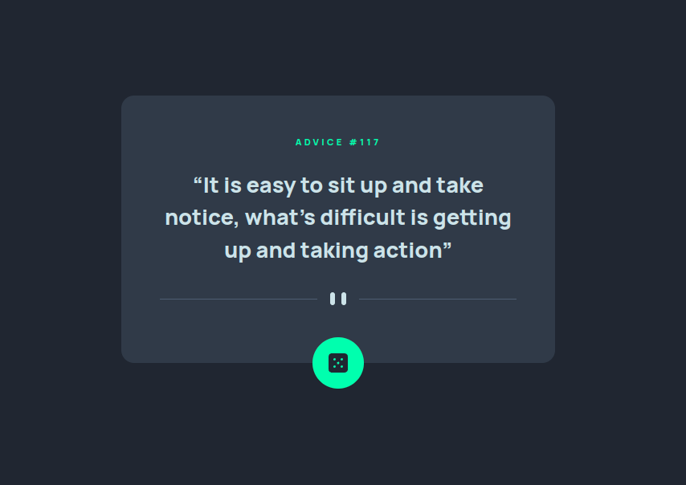

# Frontend Mentor - Advice generator app solution

This is a solution to the [Advice generator app challenge on Frontend Mentor](https://www.frontendmentor.io/challenges/advice-generator-app-QdUG-13db). Frontend Mentor challenges help you improve your coding skills by building realistic projects.

## Table of contents

- [Overview](#overview)
  - [Screenshot](#screenshot)
  - [Links](#links)
- [My process](#my-process)
  - [Built with](#built-with)
  - [What I learned](#what-i-learned)
  - [Continued development](#continued-development)
- [Author](#author)
- [Acknowledgments](#acknowledgments)
- [Run Project](#how-to-run-project)

## Overview

### The challenge

Users should be able to:

- View the optimal layout for the app depending on their device's screen size
- See hover states for all interactive elements on the page
- Generate a new piece of advice by clicking the dice icon

### Screenshot



### Links

- Solution URL: [Solution](https://www.frontendmentor.io/solutions/vue-2-tailwindcssv3-axios-jest-RKcUT79Kt)
- Live Site URL: [Live](https://nifty-hodgkin-270bdd.netlify.app/)

## My process

### Built with

- Semantic HTML5 markup
- Flexbox
- Mobile-first workflow
- [Vue.js](https://vuejs.org/) - front-end framework
- [Jest](https://jestjs.io/) - for unit testing
- [TailwindCSS](https://tailwindcss.com/) - CSS Framework

### What I learned

Mastering TailwindCSS v3

### Continued development

I want to complete these challenges using vue :)

## Author

- Github - [Mikołaj Szymczuk](https://github.com/mikolajszymczuk1)
- Frontend Mentor - [@mikolajszymczuk1](https://www.frontendmentor.io/profile/mikolajszymczuk1)

## Acknowledgments

LOVE VUE <3

<br>
<br>

# How to run project

## Project setup
```
npm install
```

### Compiles and hot-reloads for development
```
npm run serve
```

### Compiles and minifies for production
```
npm run build
```

### Run your unit tests
```
npm run test:unit
```

### Lints and fixes files
```
npm run lint
```

### Customize configuration
See [Configuration Reference](https://cli.vuejs.org/config/).
